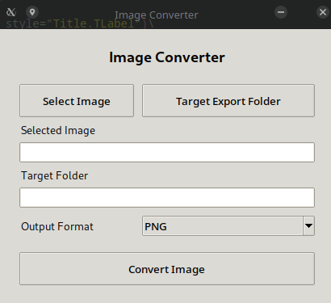

# Image Converter (Python + Tkinter)

Simple desktop image converter built with Python and Tkinter.




## Features
- Select image
- Select target folder
- Convert image formats (PNG, JPEG, BMP, GIF)
- Cross-platform

## Requirements
```bash
pip install pillow
```

## Run

```bash
python main.py
```
